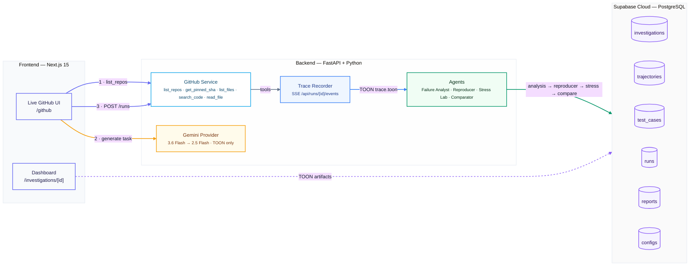

# ReproForge — Turn agent failures into reproducible tests.

> **An agent reliability lab that turns a failed trajectory into evidence: what failed, can we reproduce it, and does the fix actually help?**

[](https://nextjs.org)
[](https://fastapi.tiangolo.com)
[](https://supabase.com)
[](#trace-format)
[](https://ai.google.dev)

---

## Overview

ReproForge is an evidence-driven lab for AI agents. It takes a **real GitHub run**, pins the commit, streams a **TOON** trace live, classifies the outcome, **minimizes** the failure to a few events, **stress-tests** it with controlled perturbations, and **compares** a baseline vs candidate config on the same frozen cases.

**Mental model:** `pytest for failed agent trajectories` — `Observe → Reproduce → Minimize → Perturb → Compare → Prove`

It does not replace LangSmith / Maxim AI / Phoenix. It starts where they stop: from an observed trajectory to an *executable, minimized regression test*.

---

## Architecture



**Stack:** Next.js 15 + Tailwind + shadcn/ui | FastAPI + Pydantic + SlowAPI + `google-genai>=2.0.0` | Supabase Cloud (PostgreSQL) | Gemini `3.6-flash` primary → `2.5-flash` fallback | TOON (~40% token savings)

**Real data only — no mocks:** live public GitHub repos, pinned commit SHA, real Gemini calls, real `X-goog-api-key: AQ.* / AIza.*` auth, real latency/tokens.

---

## 4-Stage Workflow

| Stage | What it does |
|-------|--------------|
| **1. Analysis** | Compares frozen `task` + expected evidence vs live TOON trace. Returns `passed`/`failed`/`inconclusive` with `outcome`, `classification`, `suspected_step`, `evidence`, `confidence`. Not presuming failure. |
| **2. Reproducer** | Removes irrelevant events, replays until same outcome preserved. `20 events → ~5` becomes regression test. Stores `minimal_case` + `stats` (reduction%, tokens). |
| **3. Stress Lab** | 4 controlled perturbations: `ambiguity_injection`, `stale_context_injection`, `tool_timeout`, `tool_reorder`. Same suite executed, matrix recorded. |
| **4. Evidence** | Runs **same frozen cases** on baseline vs candidate (different prompt/model). Reports `baseline_passed/total`, `candidate_passed`, `regressions`, `avg_latency`, `tokens`, `verdict_text` → **Human Review Required** gate. |

---

## Quick Start

### 1. Env

**Backend `backend/.env.local` (secrets, never commit):**
```bash
GEMINI_API_KEY= # from https://aistudio.google.com/app/apikey — AQ.* or AIza.* both valid (paste your key here)
GEMINI_MODEL=gemini-3.6-flash              # v1beta current (replaces 2.0-flash)
GEMINI_FALLBACK_MODEL=gemini-2.5-flash     # fallback
GITHUB_TOKEN=github_pat_...                 # optional, for private repos
SUPABASE_URL=https://your-project.supabase.co
SUPABASE_ANON_KEY=...
SUPABASE_SERVICE_ROLE_KEY=...
SQLITE_PATH=./reproforge.db
```

**Frontend `frontend/.env.local` (no GEMINI key):**
```bash
NEXT_PUBLIC_SUPABASE_URL=https://your-project.supabase.co
NEXT_PUBLIC_SUPABASE_ANON_KEY=sb_publishable_...
NEXT_PUBLIC_API_URL=http://localhost:8000
API_URL=http://localhost:8000
```

Free without billing: `gemini-3.6-flash`/`2.5-flash` have free daily quota (60 RPM). If `429 RESOURCE_EXHAUSTED: prepayment credits are depleted`, go `https://ai.studio/projects` → that project → Add billing, or create a **new project** → new `AQ...` key → paste to `backend/.env.local:1` → restart.

`.env.example` files in `/`, `/backend`, `/frontend` contain placeholders only — copy to `.env.local`.

### 2. Backend
```cmd
cd "C:\Users\avira\OneDrive\Desktop\Repo Forge\backend"
python -m venv .venv
.venv\Scripts\activate
pip install -r requirements.txt
uvicorn app.main:app --reload --port 8000
```
→ `http://localhost:8000/healthz` (must be `supabase_connected:true`, `models: 3.6-flash→2.5-flash`) and `http://localhost:8000/docs`

### 3. Frontend
```cmd
cd "C:\Users\avira\OneDrive\Desktop\Repo Forge\frontend"
npm install
npm run dev
```
→ `http://localhost:3000` and `http://localhost:3000/github` (any public GitHub username → pinned SHA → task → SSE live trace)

### 4. DB
Run `supabase/schema.sql` once in Supabase SQL Editor before starting. Creates `configs`, `investigations`, `reports`, `runs`, `test_cases`, `trajectories` (+ `workflow_artifacts` for tab persistence). `/healthz` checks tables.

### 5. Benchmark
```bash
python benchmark/evaluate.py --config baseline
python benchmark/evaluate.py --config candidate
python benchmark/compare.py
# results/: baseline.toon / candidate.toon / comparison.toon / trajectories/
```

---

## Live GitHub Demo (used in video)

Investigation against **Loan Calculator** repo, pinned commit SHA. Task:

> *What ZIP archive is located in the repository root directory, and what header title is present in README.md?*

Agent must call `list_repository_files` + `read_file` and cite exact files, not hallucinate. Trace stores `run_id`, `repository`, `commit`, `model`, `user_task`, `tool_call/result`, `final_decision` in TOON.

---

## Trace Format — TOON

```text
data/real_traces/run_d78d4223.toon
datasets/github/case_774fd572/task.toon
```

TOON is primary I/O (`Content-Type: application/toon`), JSON not accepted. Saves ~40% tokens vs JSON.

---

## Project Structure

```text
reproforge/
├── frontend/ (Next.js 15 — /github live flow, /investigations/[id] 4 tabs)
├── backend/ (FastAPI — /api/github/*, /api/runs/*/events SSE, /api/investigations/*)
├── supabase/schema.sql
├── benchmark/
├── datasets/github/{case_id}/task.toon + trace.toon
├── data/real_traces/
├── .env.example (root + backend + frontend — placeholders)
└── README.md
```

## Troubleshooting

- `Failed to fetch` on all tabs → backend not running or `NEXT_PUBLIC_API_URL` not reloaded: `rmdir /s /q frontend\.next` → `npm run dev`; check `http://localhost:8000/healthz`
- `429 prepayment depleted` → free quota exhausted, new project key needed
- `404 model ... is no longer available` → update `GEMINI_MODEL` to `gemini-3.6-flash` (see `backend/.env.local`)
- `hydration failed fdprocessedid` → fixed via `suppressHydrationWarning` in `app/github/page.tsx`
- `reproducer AttributeError: 'str' object has no attribute 'get'` → fixed via `isinstance(e, dict)` guards

---

**ReproForge — Turn agent failures into reproducible tests.**
