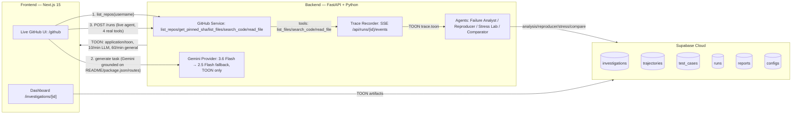

# ReproForge — Turn agent failures into reproducible tests.

> **An agent reliability lab that turns a failed trajectory into evidence: what failed, can we reproduce it, and does the fix actually help?**

[](https://nextjs.org)
[](https://fastapi.tiangolo.com)
[](https://supabase.com)
[](#trace-format)
[](https://ai.google.dev)

---

## Overview

ReproForge is an evidence-driven lab for AI agents. It takes a **real GitHub run**, pins the commit, streams a **TOON** trace live, classifies the outcome, **minimizes** the failure to a few events, **stress-tests** it with controlled perturbations, and **compares** a baseline vs candidate config on the same frozen cases.

**Mental model:** `pytest for failed agent trajectories` — `Observe → Reproduce → Minimize → Perturb → Compare → Prove`

It does not replace LangSmith / Maxim AI / Phoenix. It starts where they stop: from an observed trajectory to an *executable, minimized regression test*.

---

## Architecture



**Stack:** Next.js 15 + Tailwind + shadcn/ui | FastAPI + Pydantic + SlowAPI + `google-genai>=2.0.0` | Supabase Cloud (PostgreSQL) | Gemini `3.6-flash` primary → `2.5-flash` fallback | TOON (~40% token savings)

**Real data only — no mocks:** live public GitHub repos, pinned commit SHA, real Gemini calls, real `X-goog-api-key: AQ.* / AIza.*` auth, real latency/tokens.

---

## 4-Stage Workflow

| Stage | What it does |
|-------|--------------|
| **1. Analysis** | Compares frozen `task` + expected evidence vs live TOON trace. Returns `passed`/`failed`/`inconclusive` with `outcome`, `classification`, `suspected_step`, `evidence`, `confidence`. Not presuming failure. |
| **2. Reproducer** | Removes irrelevant events, replays until same outcome preserved. `20 events → ~5` becomes regression test. Stores `minimal_case` + `stats` (reduction%, tokens). |
| **3. Stress Lab** | 4 controlled perturbations: `ambiguity_injection`, `stale_context_injection`, `tool_timeout`, `tool_reorder`. Same suite executed, matrix recorded. |
| **4. Evidence** | Runs **same frozen cases** on baseline vs candidate (different prompt/model). Reports `baseline_passed/total`, `candidate_passed`, `regressions`, `avg_latency`, `tokens`, `verdict_text` → **Human Review Required** gate. |

---

## Quick Start

### 1. Env

**Backend `backend/.env.local` (secrets, never commit):**
```bash
GEMINI_API_KEY= # from https://aistudio.google.com/app/apikey — AQ.* or AIza.* both valid (paste your key here)
GEMINI_MODEL=gemini-3.6-flash              # v1beta current (replaces 2.0-flash)
GEMINI_FALLBACK_MODEL=gemini-2.5-flash     # fallback
GITHUB_TOKEN=github_pat_...                 # optional, for private repos
SUPABASE_URL=https://your-project.supabase.co
SUPABASE_ANON_KEY=...
SUPABASE_SERVICE_ROLE_KEY=...
SQLITE_PATH=./reproforge.db
```

**Frontend `frontend/.env.local` (no GEMINI key):**
```bash
NEXT_PUBLIC_SUPABASE_URL=https://your-project.supabase.co
NEXT_PUBLIC_SUPABASE_ANON_KEY=sb_publishable_...
NEXT_PUBLIC_API_URL=http://localhost:8000
API_URL=http://localhost:8000
```

Free without billing: `gemini-3.6-flash`/`2.5-flash` have free daily quota (60 RPM). If `429 RESOURCE_EXHAUSTED: prepayment credits are depleted`, go `https://ai.studio/projects` → that project → Add billing, or create a **new project** → new `AQ...` key → paste to `backend/.env.local:1` → restart.

`.env.example` files in `/`, `/backend`, `/frontend` contain placeholders only — copy to `.env.local`.

### 2. Backend
```cmd
cd "C:\Users\avira\OneDrive\Desktop\Repo Forge\backend"
python -m venv .venv
.venv\Scripts\activate
pip install -r requirements.txt
uvicorn app.main:app --reload --port 8000
```
→ `http://localhost:8000/healthz` (must be `supabase_connected:true`, `models: 3.6-flash→2.5-flash`) and `http://localhost:8000/docs`

### 3. Frontend
```cmd
cd "C:\Users\avira\OneDrive\Desktop\Repo Forge\frontend"
npm install
npm run dev
```
→ `http://localhost:3000` and `http://localhost:3000/github` (any public GitHub username → pinned SHA → task → SSE live trace)

### 4. DB
Run `supabase/schema.sql` once in Supabase SQL Editor before starting. Creates `configs`, `investigations`, `reports`, `runs`, `test_cases`, `trajectories` (+ `workflow_artifacts` for tab persistence). `/healthz` checks tables.

### 5. Benchmark
```bash
python benchmark/evaluate.py --config baseline
python benchmark/evaluate.py --config candidate
python benchmark/compare.py
# results/: baseline.toon / candidate.toon / comparison.toon / trajectories/
```

---

## Live GitHub Demo (used in video)

Investigation against **Loan Calculator** repo, pinned commit SHA. Task:

> *What ZIP archive is located in the repository root directory, and what header title is present in README.md?*

Agent must call `list_repository_files` + `read_file` and cite exact files, not hallucinate. Trace stores `run_id`, `repository`, `commit`, `model`, `user_task`, `tool_call/result`, `final_decision` in TOON.

---

## Trace Format — TOON

```text
data/real_traces/run_d78d4223.toon
datasets/github/case_774fd572/task.toon
```

TOON is primary I/O (`Content-Type: application/toon`), JSON not accepted. Saves ~40% tokens vs JSON.

---

## Synthesia-Ready 5-Minute Script

### Scene 1 — Title
On screen: ReproForge logo + tagline
Duration: ~15 sec

Narration:

“Hi, this is ReproForge — an agent reliability lab that turns AI-agent failures into reproducible tests.

The goal is simple: when an agent fails, I want more than a trace. I want evidence of why it failed, whether I can reproduce it, and whether a proposed change actually improves the agent.”

### Scene 2 — The problem
On screen: simple flow: Agent → Tools → Wrong result
Duration: ~25 sec

Narration:

“AI agents now perform multi-step tasks using language models, tools, external data, and memory.

But when an agent returns a wrong result, engineers often receive a long execution trace and still need to manually answer three questions:

What caused the failure?

Can the failure be reproduced?

And did my fix actually solve the underlying problem without creating a regression?”

### Scene 3 — What ReproForge does
On screen: Analysis → Reproducer → Stress → Evidence
Duration: ~25 sec

Narration:

“ReproForge addresses this through four stages.

First, Analysis determines whether the execution passed or failed and identifies the supporting evidence.

Second, Reproducer tries to isolate the smallest trajectory that still demonstrates the failure.

Third, Stress applies controlled variations to the reproduced case.

Finally, Evidence compares the baseline agent against a candidate configuration using the same cases.

The workflow is: observe, reproduce, minimize, stress, compare, and prove.”

### Scene 4 — Real GitHub data
On screen: your investigation screenshot showing repository and commit
Duration: ~25 sec

Narration:

“For the demonstration, ReproForge uses a real public GitHub repository rather than a fabricated codebase.

This investigation is running against my Loan Calculator repository.

ReproForge records the exact Git commit used during the investigation, which is important for reproducibility.

Even if the repository changes later, the same source revision can be checked again.”

### Scene 5 — The real task
On screen: zoom into the question at the top
Duration: ~25 sec

Narration:

“The task in this investigation asks:

What ZIP archive is located in the repository root directory, and what header title is present in README dot md?

The expected evidence is based on the real repository contents.

The agent must investigate the repository and cite the exact evidence rather than simply receiving the expected answer.”

### Scene 6 — Live agent execution
On screen: Original Trajectory — TOON
Duration: ~35 sec

Narration:

“This is the original agent trajectory.

ReproForge records the run ID, repository, pinned commit, selected model, user task, model calls, tool calls, tool outputs, and final decision.

The agent uses real repository tools such as listing repository files and reading repository content.

The resulting execution is stored in TOON format.

This means ReproForge evaluates not only the final response, but also the path the agent took to reach it.”

### Scene 7 — Model architecture
On screen: Gemini 3.6 Flash → fallback → Gemini 2.5 Flash
Duration: ~20 sec

Narration:

“The primary model for ReproForge is Gemini 3.6 Flash.

If the primary request fails according to the retry policy, the system falls back to Gemini 2.5 Flash.

This model routing is handled by the FastAPI backend, while the frontend is built with Next.js.”

### Scene 8 — Analysis result
On screen: your Evaluation TOON and Evidence cards
Duration: ~35 sec

Narration:

“In the Analysis stage, ReproForge compares the frozen task and expected evidence with the actual live trajectory.

In this example, the run passed.

The system correctly identified the ZIP archive and the README header.

Notice that ReproForge also records the supporting trajectory steps.

So the result is not simply an AI-generated confidence statement.

The conclusion is connected to evidence from the real execution.”

### Scene 9 — Reproducer
On screen: Reproducer tab / conceptual before-after trace
Duration: ~35 sec

Narration:

“The Reproducer becomes most important when an agent fails.

Suppose an original failed trajectory contains twenty events.

ReproForge attempts to remove irrelevant events and rerun the case.

If the same failure still occurs with only five important events, those five events become the minimal reproducer.

That smaller trajectory can then be stored as a regression test.

Instead of manually reading a large trace each time, engineers get a compact executable case that demonstrates the problem.”

### Scene 10 — Stress testing
On screen: Stress tab and four perturbation labels
Duration: ~30 sec

Narration:

“The Stress stage tests whether a proposed fix handles the underlying failure rather than only one exact example.

ReproForge applies controlled perturbations such as ambiguous instructions, stale context, reordered tool outputs, tool failures, and rate-limit conditions.

Each variation is executed and recorded.

This helps distinguish a genuine reliability improvement from a one-off successful rerun.”

### Scene 11 — Baseline versus candidate
On screen: Evidence or Compare View
Duration: ~35 sec

Narration:

“The final stage compares a baseline agent configuration with a candidate configuration.

Both versions receive the same frozen task and the same evaluation cases.

The candidate may change a system instruction, tool description, retry strategy, or model configuration.

ReproForge compares outcomes such as task success, reproduced failures, regressions, latency, and token usage.

The goal is to measure improvement rather than simply claim that the new version feels better.”

### Scene 12 — Existing tools and differentiation
On screen: small comparison graphic
Duration: ~35 sec

Narration:

“There are already excellent agent observability and evaluation platforms such as LangSmith, Maxim AI, Phoenix, and Agent Reliability Engineering approaches.

ReproForge is not trying to replace those platforms.

Its focus is narrower.

Existing tools are excellent for observing, tracing, and evaluating agent systems.

ReproForge starts from an observed trajectory and focuses specifically on turning a failure into a minimized reproducible experiment, stress-testing it, and measuring whether a candidate agent actually improves.”

### Scene 13 — Architecture
On screen: architecture diagram
Duration: ~25 sec

Narration:

“The implementation uses Next.js for the frontend, FastAPI and Python for the backend, Supabase for investigation storage, TOON for agent trajectories, and Gemini 3.6 Flash with Gemini 2.5 Flash as the fallback.

Repository investigations use real public GitHub data with pinned commit hashes so the main result can be reproduced.”

### Scene 14 — Closing / insight
On screen: logo + tagline
Duration: ~20 sec

Narration:

“The main insight behind ReproForge is that an agent failure becomes much more useful when it stops being a one-off log and becomes an executable test.

Observability tells us what an agent did.

ReproForge turns what went wrong into a reproducible test.

ReproForge — turn agent failures into reproducible tests.”

---

## Project Structure

```text
reproforge/
├── frontend/ (Next.js 15 — /github live flow, /investigations/[id] 4 tabs)
├── backend/ (FastAPI — /api/github/*, /api/runs/*/events SSE, /api/investigations/*)
├── supabase/schema.sql
├── benchmark/
├── datasets/github/{case_id}/task.toon + trace.toon
├── data/real_traces/
├── .env.example (root + backend + frontend — placeholders)
└── README.md
```

## Troubleshooting

- `Failed to fetch` on all tabs → backend not running or `NEXT_PUBLIC_API_URL` not reloaded: `rmdir /s /q frontend\.next` → `npm run dev`; check `http://localhost:8000/healthz`
- `429 prepayment depleted` → free quota exhausted, new project key needed
- `404 model ... is no longer available` → update `GEMINI_MODEL` to `gemini-3.6-flash` (see `backend/.env.local`)
- `hydration failed fdprocessedid` → fixed via `suppressHydrationWarning` in `app/github/page.tsx`
- `reproducer AttributeError: 'str' object has no attribute 'get'` → fixed via `isinstance(e, dict)` guards

---

**ReproForge — Turn agent failures into reproducible tests.**
