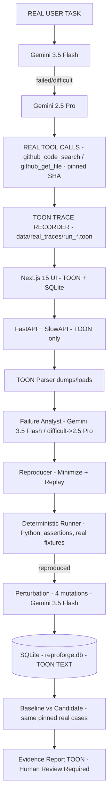

# ReproForge Architecture — Clean Stack

**Frontend:** Next.js 15 + TypeScript + Tailwind CSS + shadcn/ui  
**Backend:** Python + FastAPI + Pydantic + SQLite  
**AI:** Gemini 3.5 Flash — Primary → Gemini 2.5 Pro — Fallback (real, `GEMINI_API_KEY`)  
**Data / Traces:** TOON only (`data/real_traces/*.toon`, no JSON)  
**Real data source:** Public GitHub repos, pinned commit SHAs, real tool responses, real Gemini  
**Evaluation:** Python deterministic runner, human-verified ground truth, Baseline vs Candidate



## Flow
Observe → Reproduce → Minimize → Perturb → Compare → Prove

- **Frontend** Next.js 15 (App Router) + `toon.ts` + `rate-limit.ts` + shadcn/ui + 429 handling
- **Backend** Python + FastAPI + Pydantic + SQLite (`reproforge.db`, `SQLITE_PATH`) + SlowAPI (60/20/10) + `toon.py` + `github.py`
- **AI** Gemini 3.5 Flash (primary) for normal tasks, Gemini 2.5 Pro for difficult/ambiguous + fallback on 429/5xx via `run_model(difficult)`
- **Deterministic Lab** Python runner + real fixtures (file/order) + assertions (human-verified) + replay checks
- **DB** SQLite: investigations, trajectories (TOON), test_cases (TOON), runs, configs, reports, rate_limit_logs — TOON TEXT, no JSONL

## Rate Limiting
Backend SlowAPI + custom sliding window: `60/min` general, `20/min` ingest, `10/min` LLM (analyze/reproduce/stress/compare) → `429 Retry-After` + `X-RateLimit-*`. Frontend disables buttons with countdown.

## TOON
All LLM and trace payloads are `application/toon`. ~30-60% fewer tokens than JSON. Stored as TEXT in SQLite after `toon.validate`. Frontend `toon.ts` mirrors `toon.py`.

## Gemini Routing
```python
async def run_model(messages, difficult=False):
    if difficult:
        return await gemini_pro.generate(messages)  # gemini-2.5-pro
    try:
        return await gemini_flash.generate(messages)  # gemini-3.5-flash
    except Exception:
        return await gemini_pro.generate(messages)
```
Tasks: failure classification/trace summarization/perturbation/reproducer → 3.5 Flash; ambiguous/difficult → 2.5 Pro.

## SQLite Only
No Supabase. DB auto-creates on first run (`backend/reproforge.db`). Health `GET /healthz` shows `mode: sqlite`, `model_primary: gemini-3.5-flash`, `model_fallback: gemini-2.5-pro`.

## Real Traces
`data/real_traces/run_*.toon` — real public repos (`vercel/next.js`, `facebook/react`, `auth0/node-jsonwebtoken`, `supabase/supabase`), pinned SHAs (e.g., `2fe6f96...`), real `github_code_search`/`github_get_file` outputs, `human_verified:true`, `expected` vs `actual`, `passed:false`. Generated via `scripts/generate_real_traces.py` using real Gemini + GitHub (read-only).

## Verification
- `GET /healthz` → `sqlite`, `gemini-3.5-flash -> gemini-2.5-pro`, `toon`, `rate limiting`
- `POST /api/investigations/{id}/analyze` etc. enforce 10/min per IP
- `pytest backend/tests/test_toon.py` validates TOON
- `python benchmark/evaluate.py --config baseline` (requires `GEMINI_API_KEY`, uses `data/real_traces/*.toon`, TOON only) → `results/baseline.toon`
- `python benchmark/compare.py` → `results/comparison.toon` + `report.txt` (Baseline vs Candidate, human approval required)
